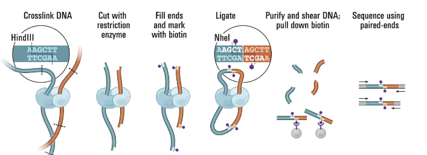

# HiC



A pair thus obtained comes from two fragments in different locations (but physically close together). 

```
@SRR14251345.1 1/1
TNGCTTGAGACACCCTTCTTCGACTGTTACCCAAGCTGTTCGATTCGCGGATGACACGTCGTTTATTTCGCCGAAATTTG
+
A#/AAEE6AEEEEEEEAEEEA<AEEEEEAEAEAEEEEEAEEEEEAEEEEEEEAEE/6A<AEE<EAEEEAE</EEE/EEEA

@SRR14251345.1 1/2
GNATTGGATAGAGTAGGATAGCCGGGAGGATCGATCGGCTATCCGATTTTTATTTCACGTGGAAATTAATTCGCTTCGCG
+
A#AAAEEEEEEAEEEEEEEAEEEEAEEEEEEEEEEE/EEEEEEEEEEEEEEEEEEEEEEEEAEEAE/AE6E<AE/E/<EE
```


```
@SRR14251351.1 1/1
AACTTCGAATGGCCCGGTCTCGCAGAACTCCATTCCGCCGAAAAAGGCTTCGCCCTGAAATAGTTTCGCTAGGCTAGCGT
+
A/AAA6EEEEEEAEEE6/E/AEAE//EE66E/EEE/EEE/EE//E/E//A/E//6EE//AEEA/EEEE/A/EEEE/E/</

@SRR14251351.1 1/2
GATCTAGNTAGTNGTCCNTCGCNGNAGCNGNAAAAGNAGATGTACCTACACNGNTANNNANNATNTNTGCTGAANTTTAN
+
A/AAA6E#AE/A#EE/E#EEEA#E#/EA#A#E6E/E#EEEEE/EEAE/AEA#E#//###/##E/#A#AEA/E/E#A6E/#
```
